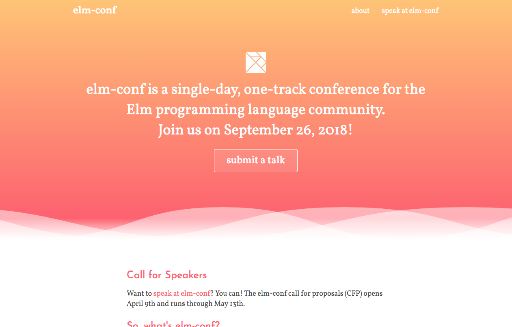

# elm-conf 2018

## Building

You'll need (but probably already have) `make`, `npm`, and `python`.
Just run `make` and everything will be taken care of for you.
The site will appear in `public`.

If you install [`modd`](https://github.com/cortesi/modd) and [`devd`](https://github.com/cortesi/devd) you can instead run `modd` and browse the site at `localhost:8000`.
Changes will be automatically rebuilt and the site reloaded.
